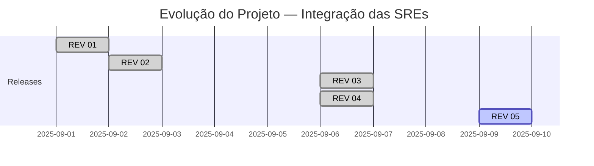

# ⚠️ **Protótipo em desenvolvimento REV 05!**

**Versões e Evolução do Projeto**

| Revisão | Data         | SREs Integradas         | Novidades principais                                 |
|---------|--------------|------------------------|------------------------------------------------------|
| REV 01  | 2025-09-01   | Varginha               | Primeira versão funcional: busca e cards SRE Varginha |
| REV 02  | 2025-09-02   | Varginha, Poços Caldas | Adicionada SRE Poços de Caldas                       |
| REV 03  | 2025-09-06   | Varginha, Poços Caldas, Itajubá | Adicionada SRE Itajubá, modal de processamento |
| REV 04  | 2025-09-06   | Varginha, Poços Caldas, Itajubá, Pouso Alegre | Adicionada SRE Pouso Alegre, scraping de tabelas |
| REV 05  | 2025-09-09   | Varginha, Poços Caldas, Itajubá, Pouso Alegre, Caxambu, Campo Belo, São João Del Rey | Integração de novas SREs, scraping paginado (10 páginas/60 cards), modal de processamento para todas as SREs, botão Limpar Pesquisa, melhorias de UX |

## Versão atual: **REV 05 — SRE Varginha, Poços de Caldas, Itajubá, Pouso Alegre, Caxambu, Campo Belo e São João Del Rey integradas**

Este projeto está em fase inicial e irá integrar os dados das SREs de Varginha, Poços de Caldas, Campo Belo, Pouso Alegre, Itajubá, Caxambu e São João Del Rey para monitoramento e participação nos processos de caixa escolar.


## Novidades da REV 05

- Integração das SREs Caxambu, Campo Belo e São João Del Rey.
- Scraping paginado para todas as SREs principais (10 páginas/60 cards).
- Scraping detalhado via "leia mais" para Campo Belo.
- Modal de processamento para todas as SREs (feedback visual).
- Botão "Limpar Pesquisa" para resetar o formulário e retornar ao estado inicial.
- Dropdown de SRE sem seleção padrão (usuário precisa escolher).
- Correção do action do formulário para evitar fallback para Varginha.
- Remoção de parâmetros e dropdown de "publicações" (paginação fixa).
- Refatoração: scraping de Varginha isolado em seu módulo.
- Pequenas melhorias de UX e documentação.

O maior desafio é unificar informações de diferentes SREs, pois cada uma possui estrutura e padrão próprios, dificultando a padronização dos dados.

Futuramente, o projeto será migrado para Python/React, visando maior flexibilidade e escalabilidade.

O protótipo está disponível via deploy Railway em:
👉 https://apppesquisalicitacoes-production.up.railway.app/


### Pesquisador de Licitações Escolares — REV 05

#### Linha do Tempo das Revisões



**Resumo das revisões:**
- **REV 01:** Primeira versão funcional, integração com SRE Varginha, busca e exibição de cards.
- **REV 02:** Adicionada integração com SRE Poços de Caldas, melhorias de scraping e interface.
- **REV 03:** Adicionada integração com SRE Itajubá, modal de processamento visual para buscas dessa origem.
- **REV 04:** Adicionada integração com SRE Pouso Alegre, scraping de tabelas e cards customizados.
- **REV 05:** Integração de Caxambu, Campo Belo e São João Del Rey, scraping paginado (10 páginas/60 cards), modal de processamento para todas as SREs, botão Limpar Pesquisa, melhorias de UX e refatoração.


Este projeto é um aplicativo web desenvolvido em Python utilizando Flask, BeautifulSoup4 e Requests. Ele permite pesquisar licitações diretamente dos sites das SREs (exemplo: Varginha-MG e Poços de Caldas-MG), exibindo os resultados em uma interface moderna com Tailwind CSS.
O objetivo é criar uma ferramenta prática para uso no dia a dia, centralizando dados de várias secretarias de educação. Futuramente, o projeto pode evoluir para Python + React e abranger mais SREs.

## Tecnologias Utilizadas

- **Python 3**
- **Flask**: Framework web para Python
- **BeautifulSoup4**: Biblioteca para raspagem de dados HTML
- **Requests**: Biblioteca para requisições HTTP
- **Tailwind CSS**: Utilizado via CDN para estilização da interface


## Estrutura do Projeto

```
app_pesquisa_licitacoes/
├── app.py
├── requirements.txt
├── sre_varginha.py
├── sre_pocoscaldas.py
├── sre_itajuba.py
├── sre_pousoalegre.py
├── sre_caxambu.py
├── sre_campobelo.py
├── sre_saojoaodelrey.py
├── templates/
│   └── index.html
├── .env (opcional, para variáveis locais)
```

## Passo a Passo para Executar o Projeto

1. **Configurar o ambiente Python**
   - Abra a pasta raiz do projeto no VS Code.
   - Certifique-se de que um interpretador Python está selecionado (veja na barra inferior do VS Code).

2. **Abrir o Terminal Integrado**
   - Menu: `Terminal > New Terminal` ou atalho `Ctrl+J`.
   - Garanta que o terminal está na pasta raiz do projeto.


3. **Instalar as dependências**
      - Ative o ambiente virtual (recomendado):
         ```bash
         python -m venv .venv
         source .venv/bin/activate
         ```
      - Instale as dependências:
         ```bash
         pip install -r requirements.txt
         ```


4. **Executar o aplicativo Flask**
      - No terminal, execute:
         ```bash
         python app.py
         ```
      - Se a porta 5000 estiver ocupada, rode em outra porta:
         ```bash
         PORT=5050 python app.py
         ```
      - O servidor Flask será iniciado. Você verá uma mensagem como:
         ```
         * Running on http://127.0.0.1:5000
         Press CTRL+C to quit
         ```

5. **Acessar o aplicativo no navegador**
   - Abra o navegador e acesse: [http://127.0.0.1:5000]

6. **Testar a funcionalidade**
   - Digite uma palavra-chave na caixa de pesquisa e clique em "Pesquisar".
   - Selecione a origem dos dados desejada (Varginha, Poços de Caldas ou Itajubá).
   - Os cards de licitações que contêm a palavra-chave na seção "ESPECIFICAÇÃO DO OBJETO:" serão exibidos.


## Observações

- Os arquivos de scraping (`sre_varginha.py`, `sre_pocoscaldas.py`, `sre_itajuba.py`, `sre_pousoalegre.py`, `sre_caxambu.py`, `sre_campobelo.py` e `sre_saojoaodelrey.py`) estão na raiz do projeto.
- Os imports no `app.py` usam `from sre_varginha import ...`, `from sre_pocoscaldas import ...`, `from sre_itajuba import ...`, `from sre_pousoalegre import ...`, `from sre_caxambu import ...`, `from sre_campobelo import ...` e `from sre_saojoaodelrey import ...`.
- O Tailwind CSS é utilizado via CDN, não sendo necessário instalar nada adicional para o frontend.
- O aplicativo é para uso em ambiente de desenvolvimento. Para produção, utilize um servidor WSGI adequado.
- Para SRE Itajubá, o modal de processamento é exibido automaticamente ao clicar em "Pesquisar" e desaparece ao final da busca.
- Se encontrar erros, compartilhe a mensagem exata do terminal ou navegador para suporte.

---
